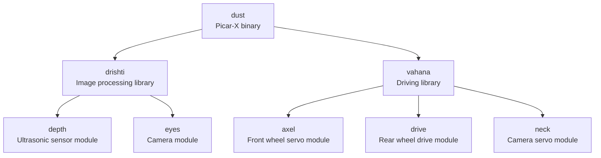

# picars
Autonomous Vehicle using Raspberry Pi and PiCar-X kit created using Rust

# Folder Structure

# Pin Configuration

| Component | Pin (robot-hat) |
| :------- | :--------: |
| mcu_reset_pin | 5 |
| ultrasonic_trig_pin | D2 |
| ultrasonic_echo_pin | D3 |
| left_motor_dir_pin | D4 |
| right_motor_dir_pin | D5 |
| camera_servo_pin1 | P0 |
| camera_servo_pin2 | P1 |
| dir_servo_pin | P2 |
| left_motor_pwm_pin | P12 |
| right_motor_pwm_pin | P13 |
